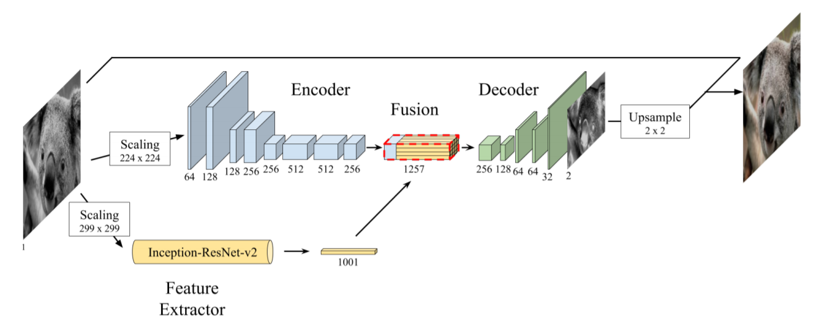

# Colorization-Deep Learning
This the implementation of the paper **Deep Koalarization: Image Colorization using CNNs and Inception-ResNet-v2**. I have implemented this paper in Keras

[Paper Link](https://arxiv.org/abs/1712.03400)

Coloring the black and white images has been a very well known problem in the field of deep learning. Lots of approches have been made in achieving the goal of coloring a hgrey-scale image using deep learning. In the paper which is implemented here the writer's of the paper propose a model which combines a deep Convolutional Neural Network trained from scratch with high-level features extracted from the Inception-ResNet-v2 pre-trained model.

I have used colornet dataset which is public dataset on FloydHub. A total of 9000 images. the model was trained for 1000 epochs.

**Architecture of model is shown below**

##the image taken from the original paper
